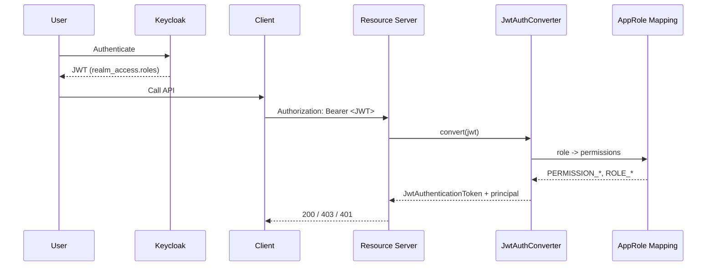

# Authentication & Authorization Flow

```mermaid
sequenceDiagram
    participant U as User
    participant KC as Keycloak
    participant C as Client
    participant R as Resource Server
    participant CV as JwtAuthConverter
    participant AP as AppRole Mapping

    U->>KC: Authenticate
    KC-->>U: JWT (realm_access.roles)
    U->>C: Call API
    C->>R: Authorization: Bearer <JWT>
    R->>CV: convert(jwt)
    CV->>AP: role -> permissions
    AP-->>CV: PERMISSION_*, ROLE_*
    CV-->>R: JwtAuthenticationToken + principal
    R-->>C: 200 / 403 / 401
```
