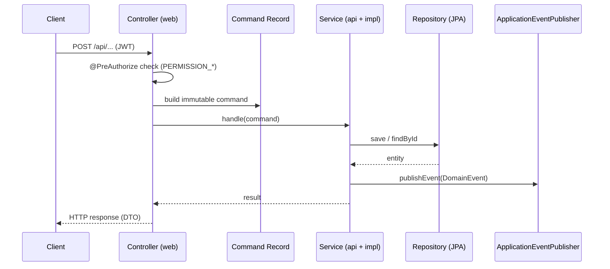

# CQRS Request Flow

```mermaid
sequenceDiagram
    participant C as Client
    participant CT as Controller (web)
    participant CMD as Command Record
    participant S as Service (api + impl)
    participant R as Repository (JPA)
    participant EV as ApplicationEventPublisher

    C->>CT: POST /api/... (JWT)
    CT->>CT: @PreAuthorize check (PERMISSION_*)
    CT->>CMD: build immutable command
    CT->>S: handle(command)
    S->>R: save / findById
    R-->>S: entity
    S->>EV: publishEvent(DomainEvent)
    S-->>CT: result
    CT-->>C: HTTP response (DTO)
```
