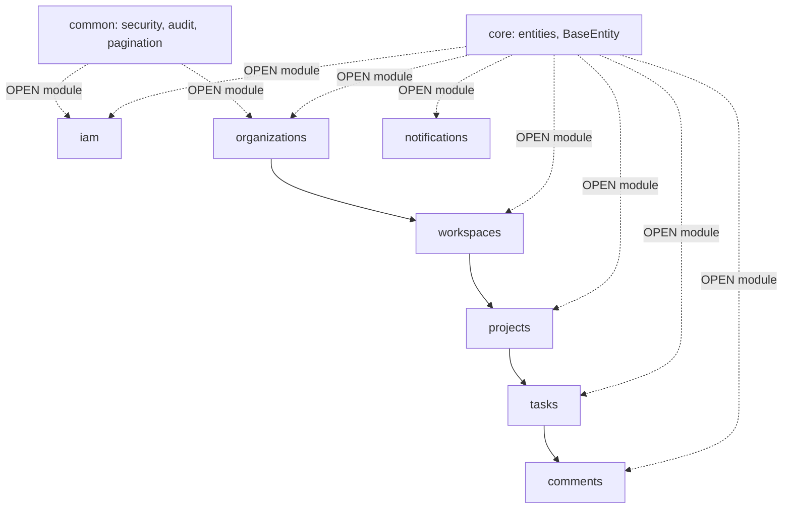

# Modulith Domain Modules & Dependencies

```mermaid
flowchart TD
    CORE[core: entities, BaseEntity]
    COMMON[common: security, audit, pagination]

    IAM[iam]
    ORG[organizations]
    WS[workspaces]
    PROJ[projects]
    TASK[tasks]
    COMMENT[comments]
    NOTIF[notifications]

    CORE -.->|OPEN module| IAM
    CORE -.->|OPEN module| ORG
    CORE -.->|OPEN module| WS
    CORE -.->|OPEN module| PROJ
    CORE -.->|OPEN module| TASK
    CORE -.->|OPEN module| COMMENT
    CORE -.->|OPEN module| NOTIF

    COMMON -.->|OPEN module| IAM
    COMMON -.->|OPEN module| ORG

    ORG --> WS
    WS --> PROJ
    PROJ --> TASK
    TASK --> COMMENT
```
