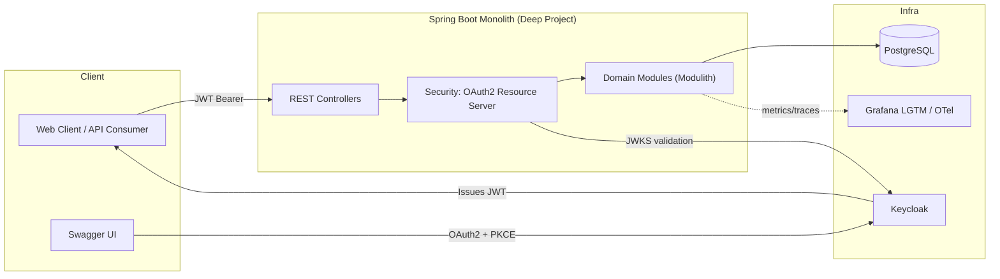

# System Context

```mermaid
flowchart LR
    subgraph Client
        UI[Web Client / API Consumer]
        Swagger[Swagger UI]
    end

    subgraph App["Spring Boot Monolith (Deep Project)"]
        REST[REST Controllers]
        SEC[Security: OAuth2 Resource Server]
        MOD["Domain Modules (Modulith)"]
    end

    subgraph Infra
        KC[Keycloak]
        PG[(PostgreSQL)]
        OTEL[Grafana LGTM / OTel]
    end

    UI -->|"JWT Bearer"| REST
    Swagger -->|"OAuth2 + PKCE"| KC
    REST --> SEC --> MOD
    MOD --> PG
    KC -->|"Issues JWT"| UI
    SEC -->|"JWKS validation"| KC
    MOD -.->|"metrics/traces"| OTEL
```
